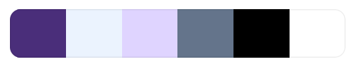
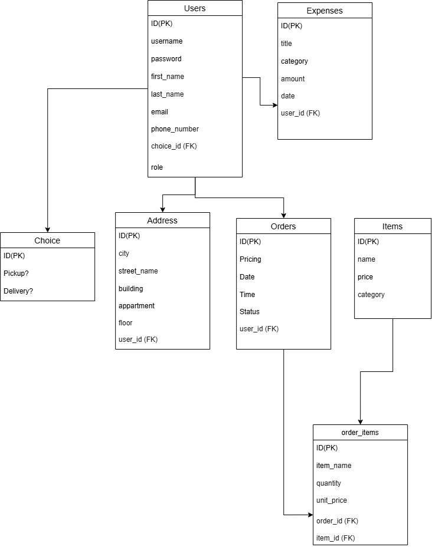

# Violetta Laundry Project

## Overview
**Violetta Laundry** is a full-stack web application designed for a local laundry and dry-cleaning service based in Jdeideh, Lebanon. The platform serves both **individual customers** and **commercial clients (hotels, businesses)**, providing a seamless interface to browse services, claim special offers, arrange pickup/delivery orders, and manage account workflows.

---

## Design System & Palette

* **Primary Color:** `#4A2E7A` / `#3B2874` (Deep Royal Purple)
* **Accent Color:** `#DFD4FF` (Soft Lavender Accent)
* **Background Light:** `#EBF3FE` / `#F3F7FF` (Ice Blue)
* **Slate/Muted Text:** `#64748B` (Cool Gray)
* **Neutral Colors:** `#FFFFFF` (White) & `#000000` (Black)
* **Typography:**
  * **Headings:** `Poppins` (Sans-Serif, 500/600/700)
  * **Body Text:** `Inter` (Sans-Serif, 400/500/600)



---

## Tech Stack

* **Frontend:** React, Vite, CSS3 (Custom Variables & Flexbox/Grid Layouts)
* **Backend:** Python, Flask, Flask-SQLAlchemy, Flask-CORS
* **Database:** SQLite
* **Design & Wireframing:** Figma
* **Database Modeling:** Draw.io
* **Version Control & Project Management:** Git, GitHub, Trello

---

## Features

- **Responsive Landing Page:** Fully aligned with custom Figma wireframes, including Hero banner, feature highlights, special offers, step-by-step process, and a dynamic store location section with direct Google Maps integration.
- **Interactive Top Navigation & Smooth Scroll:** Jump directly between Home, Services, About Us, Pricings, and Contact sections.
- **Authentication System:** Integrated modal switch for Sign In / Registration with custom role tracking (`customer`, `admin`).
- **Our Services & Offers:** Showcases Wash & Fold, Dry Cleaning, Ironing, Comforters & Blankets, Curtains, and Commercial Laundry.
- **Order Management (Pickup & Delivery):** Dedicated workflows for scheduling laundry pickups and home delivery requests.
- **User Dashboard:** Page reserved for customers to track active order progress, inspect status updates, and review order history.
- **Admin Management Dashboard:** Overview panel for administrators to manage service choices, track expenses, update order statuses, and oversee laundry operations.

---

## Database Architecture & Models

The SQLite relational database (powered by Flask-SQLAlchemy) uses the following model structure:

* **`User`**: Handles authentication credentials, contact details, and user roles (`customer`, `admin`).
* **`Choice`**: Catalog of cleaning services and pricing options.
* **`Address`**: Delivery/pickup physical addresses linked to user accounts.
* **`Order`**: Tracks order status, selected choices, scheduled pickup times, and address references.
* **`Expense`**: Internal tracking of store expenses for admin reporting.

  
🔗 [View Diagram on Draw.io](https://app.diagrams.net/)

---

## API Endpoints (Flask Backend)
**POST** :  `/api/register` : Registers a new user account 
**POST** : `/api/login` : Authenticates user credentials 

---

## Getting Started

### 1. Backend Setup (Flask)
```bash
# Navigate to backend directory
cd backend

# Create & activate virtual environment (optional but recommended)
python -m venv venv
source venv/bin/activate  # On Windows: venv\Scripts\activate

# Install dependencies
pip install flask flask-sqlalchemy flask-cors

# Start Flask server
python app.py

#Backend runs on http://localhost:5000

# Open a new terminal tab & navigate to frontend directory
cd frontend

# Install dependencies
npm install

# Run Vite dev server
npm run dev

#Frontend runs on http://localhost:5173